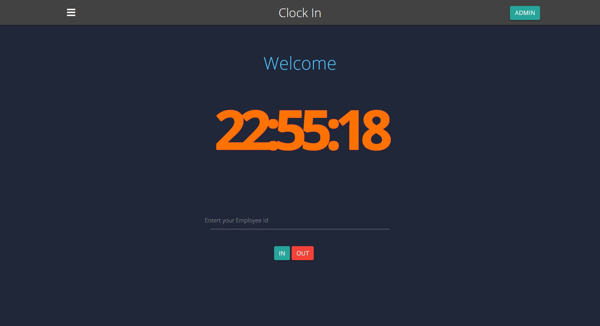
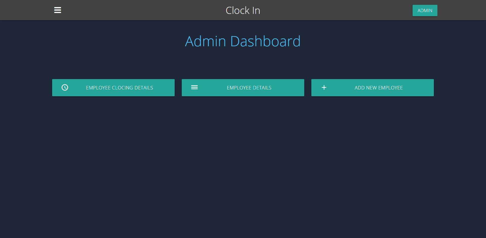
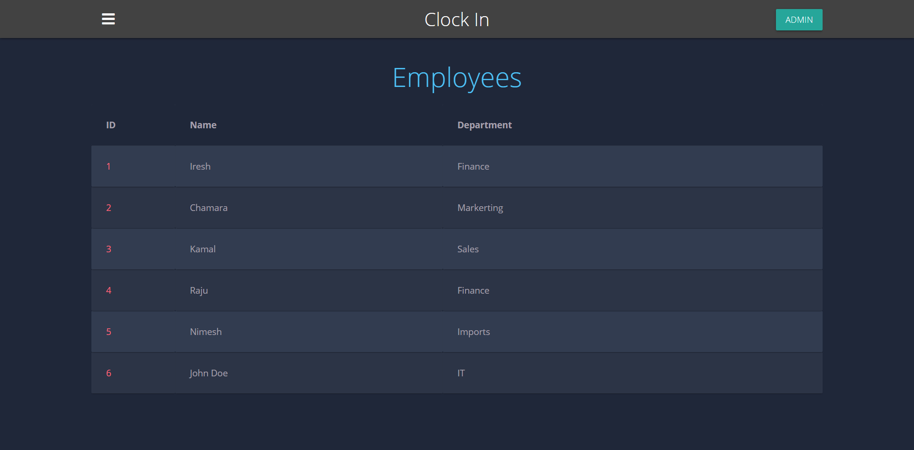

# Clocking In!

Employee clocking In and out marking application with attendance report functionality using NodeJs, Express, Handlebars and Mongo DB

#Use 1,2,3,4,5 as employee ids.

##Screen Shots.

